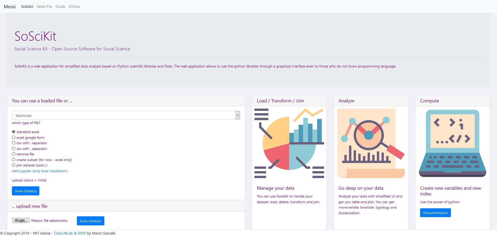

# SoSciKit
## Social Science Kit - Open Source Software for Social Science

SoSciKit is an open source web application (MIT license) that simplifies the process of data analysis - making it accessible to a wider community. Based on Python scientific libraries and Flask, the web application allows people to use a number of statistical libraries written in Python through an intuitive graphical user interface with no prerequisite of being either a programmer or a statistician. At the moment the application allows you to perform monovariate, bivariate, cross tabulation and k-mean classification operations. In addition, it allows you to recode categorical variables and create typologies.

## Installation and dependencies
You need a python interpeter installed on PC / Server. 
You need Python 3 (tested 3.6 - 3.7) to run this package. Other dependencies can be found in the requirements files

### Using pip

You can install using the pip package manager by running

    pip3.x install soscikit

## Usage

You can start SoScikit by running

    python3.x -m soscikit

it starts an HTTP server and you can access it locally in your browser at http://127.0.0.1:5555/

## How to contribute

The package is actively maintained and developed as open-source software. If SoSciKit was helpful or interesting to you, you might want to get involved. There are several ways of contributing and helping. If you would like to be a industry partner or sponsor, please [drop us a line](mailto:scarselli@gmail.com).

## Demo

You can try a [DEMO](http://soscikit.eu.pythonanywhere.com/)

